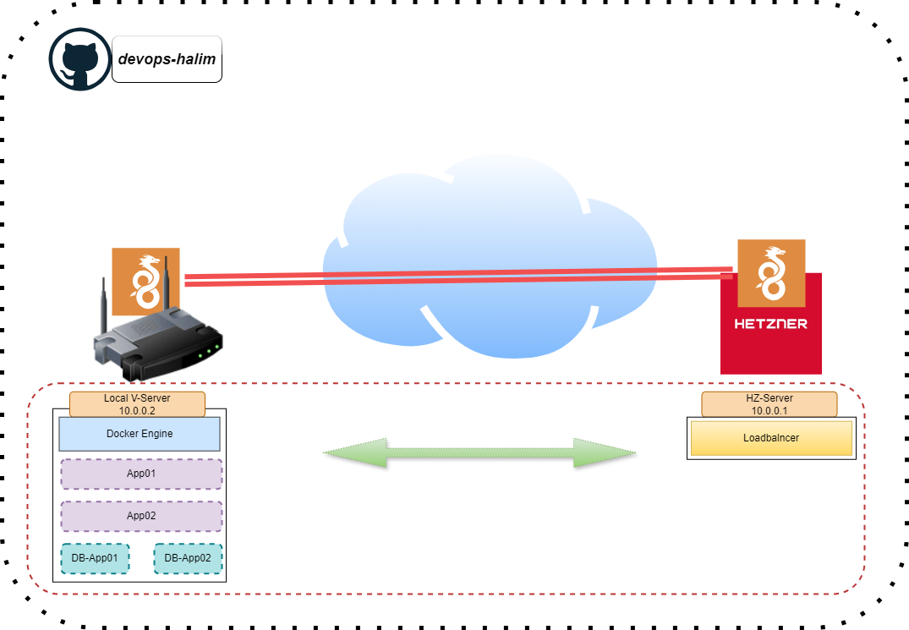

# WireGuard + HAProxy Setup for Site-to-Site VPN 

This repository contains a guide and configuration files for setting up a **site-to-site VPN** using **WireGuard** and routing traffic through **HAProxy**. The setup allows seamless access to a local application from a remote Hetzner server via a secure VPN.

---

## Features
- **Secure Site-to-Site VPN**: Use WireGuard to establish a private and encrypted connection between the Hetzner server and your local network.
- **HAProxy Load Balancing**: Proxy traffic through the Hetzner server to your local app over the VPN.
- **Scalable Configuration**: Easily extend the setup to include more peers or apps.

---

## Architecture
The setup involves the following components:

1. **WireGuard VPN**:
   - Connects a Hetzner server to your local server securely.
   - Provides access to local applications through a VPN tunnel.

2. **HAProxy**:
   - Installed on the Hetzner server to route traffic from the public internet to your local app via the VPN.

### Network Diagram


---

## Prerequisites
1. **Servers**:
   - A **Hetzner Cloud Server** (or equivalent public server).
   - A **Local Server** to host your application.
2. **Tools**:
   - Linux OS on both servers (Debian/Ubuntu recommended).
   - Root or sudo access.
   - WireGuard installed on both servers.
3. **Open Ports**:
   - **51820/UDP** for WireGuard on both servers.
   - **80/TCP** (or any desired HAProxy port) on the Hetzner server.

---

## Installation

### 1. Install WireGuard
On both the Hetzner and local servers:
```bash
sudo apt update
sudo apt install wireguard
```

### 2. Configure WireGuard
- Generate keys on both servers:
  ```bash
  wg genkey | tee privatekey | wg pubkey > publickey
  ```
- Edit `/etc/wireguard/wg0.conf` as per the architecture:
  - **Hetzner Server**:
    ```ini
    [Interface]
    Address = 10.0.0.1/24
    PrivateKey = <HetznerPrivateKey>
    ListenPort = 51820

    [Peer]
    PublicKey = <LocalPublicKey>
    AllowedIPs = 10.0.0.2/32
    Endpoint = <LocalServerPublicIP>:51820
    PersistentKeepalive = 25
    ```
  - **Local Server**:
    ```ini
    [Interface]
    Address = 10.0.0.2/24
    PrivateKey = <LocalPrivateKey>
    ListenPort = 51820

    [Peer]
    PublicKey = <HetznerPublicKey>
    AllowedIPs = 10.0.0.1/32
    Endpoint = <HetznerServerPublicIP>:51820
    PersistentKeepalive = 25
    ```

Start and enable WireGuard:
```bash
sudo systemctl enable wg-quick@wg0
sudo systemctl start wg-quick@wg0
```

### 3. Install HAProxy
On the Hetzner server:
```bash
sudo apt install haproxy
```

Configure `/etc/haproxy/haproxy.cfg`:
```ini
global
    log stdout format raw
    maxconn 2000

defaults
    log global
    option httplog
    timeout connect 5000ms
    timeout client  50000ms
    timeout server  50000ms

frontend http_in
    bind *:80
    default_backend local_app

backend local_app
    server local_app 10.0.0.2:8080 check
```

Restart HAProxy:
```bash
sudo systemctl restart haproxy
```

---

## Usage
1. Access your app via the Hetzner server's public IP:
   ```
   http://<HetznerServerPublicIP>
   ```
2. HAProxy will forward the request to the local app over the VPN.

---

## Security Tips
- Use a firewall (e.g., UFW) to restrict access to critical ports.
- Regularly update your servers and software to patch vulnerabilities.

---

## Contributing
Feel free to open issues or submit pull requests for improvements.

---

## License
This project is licensed under the MIT License.
